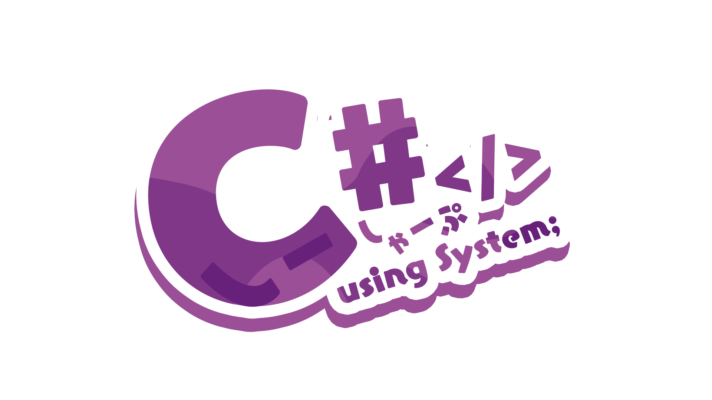
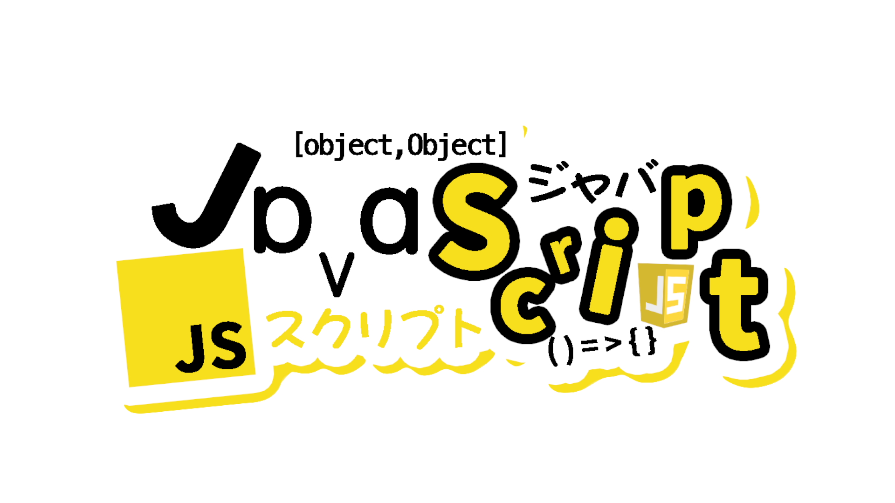

# Hi!🖐️

- I used to work at **China Unicom**.  
- I am now a **computer teacher** in a public school.

My website is here: [yinlei.pro](https://www.yinlei.pro/)

```go 
package main 
import "fmt"

func main() {
    done := make(chan int, 1)
    go func() {
        fmt.Println("Hello World!") 
        done <- 1 
    }()
    <-done
}
```

I like C++、C#、Go、Python、JavaScript and Blender.💕

<div style="text-align: center">
    
    
    
    <br>
    
    
    
    <br>
    
    
    
    <br>
    
    
    <br>
</div>

